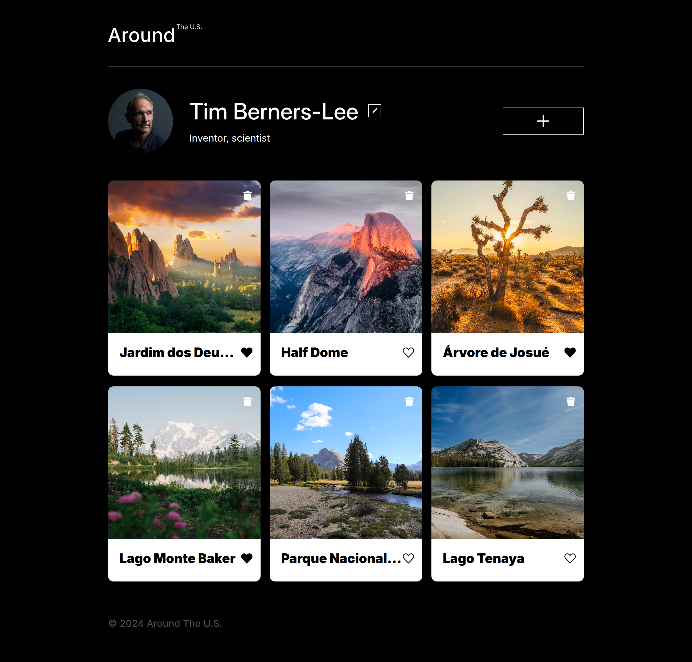

# Around the U.S. - EUA Afora

O projeto **Around the U.S. - EUA Afora** foi desenvolvido para permitir que o usuário adicione, remova ou curta fotos. Seu layout é responsivo, adaptando-se a diferentes tamanhos de tela por meio de **unidades de medida relativas** e **media queries**, ajustando o design conforme os pontos de interrupção, garantindo que o layout seja consistente e não quebre. O código foi reimplantado utilizando a tecnologia **React**, com a estrutura separada em componentes **JSX (JavaScript XML)**.

**Veja o projeto em funcionamento clicando [aqui](https://vinimello90.github.io/web_project_around_react).**

## Tecnologias e Metodologias

- HTML5 semântico
- Metodologia BEM
- Flexbox
- Grid
- Text-overflow
- Hover
- Pseudo-classe
- Unidades de medida relativas
- Media queries
- React JS
- API

## Descrição das Tecnologias e Técnicas Utilizadas

### HTML Semântico

O **HTML semântico** foi aplicado para tornar o código mais legível e acessível, melhorando a compreensão e a estruturação do conteúdo.

### Metodologia BEM

A **metodologia BEM** foi adotada para melhorar a manutenção e a escalabilidade do código, tornando a estrutura de classes mais clara e intuitiva.

### Flexbox

O `flexbox` foi utilizado em conjunto com **unidades de medida relativas** para organizar o layout e otimizar a responsividade da página, garantindo uma boa experiência em diferentes dispositivos.

### Grid e Text-overflow

A propriedade `grid` foi usada para estruturar os cartões de fotos na seção **Gallery**, criando um layout bem distribuído. A propriedade `text-overflow: ellipsis` foi aplicada junto com `overflow: hidden` e `white-space: nowrap` para truncar textos que ultrapassam o limite do layout.

- Seção "Gallery"

  

### Pseudo-classes

As **pseudo-classes** `:hover` e `:active` foram aplicadas para melhorar a interatividade do site. A primeira altera o estilo dos elementos quando o cursor passa sobre eles, enquanto a segunda é ativada quando o elemento é clicado.

### Media Queries

As **media queries** foram configuradas para garantir que o layout se ajuste corretamente em diferentes resoluções de tela. Foram definidos os seguintes pontos de interrupção:

- 320-768px (590px, 650px)
- 768-1280px (785px)
- 1280px ou superior

  

### React JS

No **React**, o código foi reestruturado usando o formato **JSX** e separado em componentes que são montados e renderizados na página.

- O evento `onClick()` foi aplicado no botão para manipular o estado das popups, utilizando a função `useState()`. Assim, ao clicar para abrir uma popup, o componente é montado e renderizado na página. Com o `useEffect()`, adiciona-se um ouvinte de evento `keydown` para fechar as popups ao pressionar a tecla "esc". Quando a popup é fechada, o ouvinte é removido com o método `removeEventListener()`. As informações de cada popup são armazenadas no estado e passadas via `props` para o componente, permitindo a abertura de popups para edição do avatar, perfil do usuário e adição de novos cartões. Além disso, com o uso de `onChange()`, `useRef()` e `onSubmit()`, é possível capturar os valores dos inputs, atualizá-los no estado, renderizá-los na página e persistir as mudanças na API.

   
  

  

- Utiliza-se o método `map()` para iterar sobre os cartões para montar o componente de cada um. Os dados são passados como `props` para renderizar o cartão na seção "gallery" da página, além de incluir uma função para alterar o estado e abrir a popup da imagem ao clicar no cartão.

  

- Dentro do `useEffect()`, instanciou-se uma classe responsável por validar os formulários, manipulando o estado para melhorar a **UX** das popups. A classe desabilita o botão de **submit** quando o formulário contém entradas inválidas, sublinhando de vermelho o **input** inválido e exibindo uma mensagem explicativa abaixo do campo. O botão **submit** só é habilitado quando o formulário é validado corretamente.

  

### API

Foi criada uma classe para interagir com a **API**, permitindo realizar solicitações **GET**, **POST**, **PATCH**, **PUT** e **DELETE** para obter, adicionar ou modificar dados no servidor. A autenticação é feita por meio de um **token**.

Funções adicionais foram implementadas para melhorar a experiência do usuário, como:

- Alterar o texto do botão de **salvar** indicando o processo de salvamento e restaurá-lo ao seu estado original após a conclusão.

  

- Uma popup de confirmação foi adicionada para a remoção de cartões, solicitando confirmação antes de enviar a solicitação à API.

  

## Planos de melhoria do projeto

- Adicionar um sistema de login e autorização.

- Identificar, através do **ID** do usuário, se o card foi adicionado por ele.

- Caso tenha sido, exibir o botão de excluir o card.
